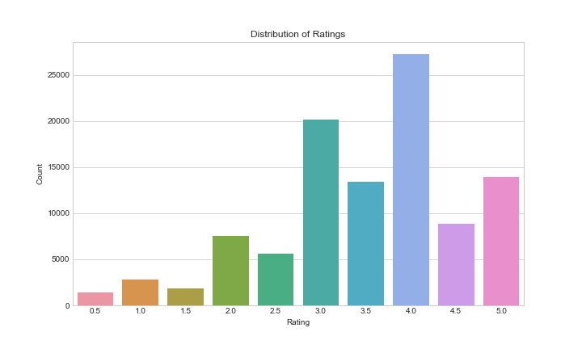
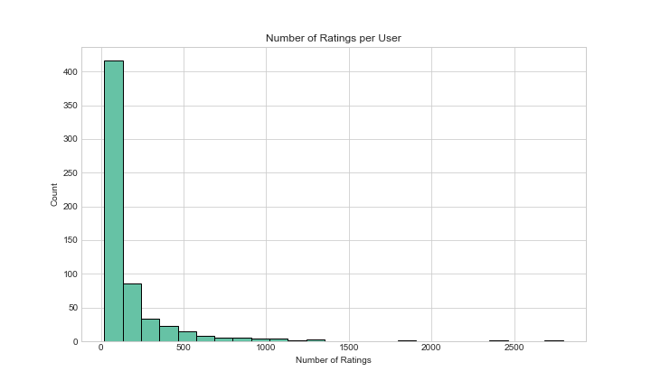
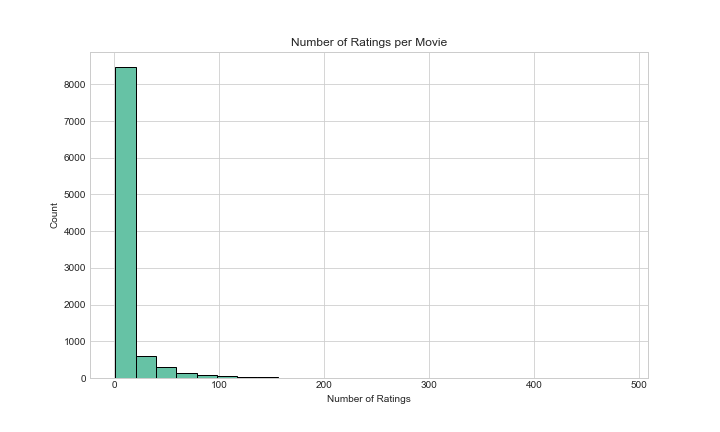
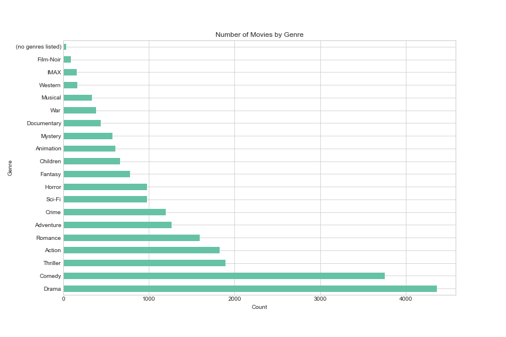
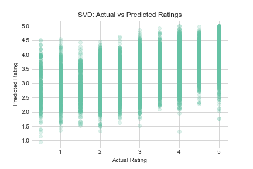
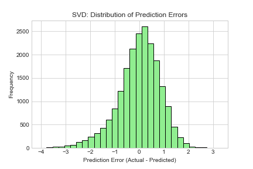
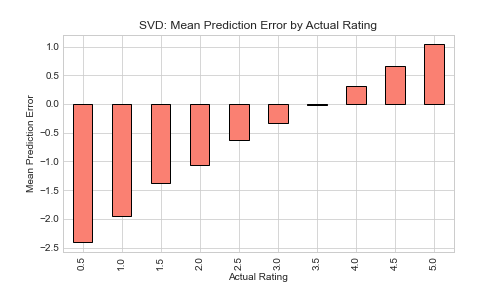
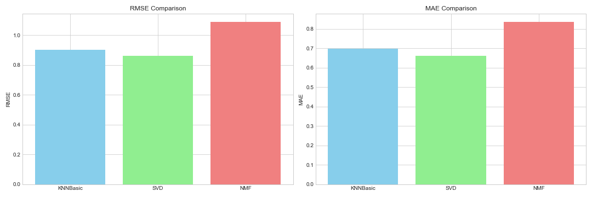

<h1 align="center">Movie Recommendation System for Sinema Pamoja</h1>

## Project Overview
Sinema Pamoja, a leading Kenyan movie studio, aims to tap into the growing digital audience by leveraging data-driven recommendations. This project uses the MovieLens dataset and advanced machine learning models to predict the top 5 movies each viewer is most likely to enjoy, driving engagement and retention.

## Business Context
- Kenya's movie industry is rapidly expanding, with more viewers accessing content online.
- Sinema Pamoja seeks to personalize the viewing experience, increasing user satisfaction and loyalty.
- Data-driven recommendations help the studio stand out in a competitive market and inform future content production.

## Workflow & Methodology
1. **Data Loading & Exploration**
   - All core MovieLens datasets (movies, ratings, links, tags) are loaded and merged for a comprehensive view.
   - Initial exploration reveals user activity, movie popularity, and rating patterns.
   - Visualizations:
     - 
     - 
     - 

2. **Genre Analysis**
   - Explores the distribution and popularity of movie genres.
   - Visualizations:
     - 

3. **Modeling & Evaluation**
   - Data is prepared for modeling using the Surprise library.
   - Three models are implemented and compared: KNNBasic, SVD, and NMF.
   - SVD (Singular Value Decomposition) provides the most accurate predictions.
   - Visualizations:
     - 
     - 
     - 
     - 

4. **Recommendation Generation**
   - Functions generate top 5 personalized movie recommendations for each user.
   - The system supports recommendations for both existing and new users.

## Key Visual Insights
- **Rating Distribution:** Most users rate movies positively, with a bias toward higher ratings.
- **User/Movie Activity:** Some users are highly active, and certain movies receive far more ratings, indicating popularity.
- **Genre Trends:** Drama, Comedy, and Action are the most common genres, but average ratings vary by genre.
- **Model Performance:** SVD outperforms other models, with lower RMSE and MAE, meaning more accurate recommendations.
- **Prediction Analysis:** Most prediction errors are small, and the model is unbiased across rating levels.

## Results & Impact
- Sinema Pamoja can deliver highly personalized recommendations, increasing watch time and user retention.
- The system provides actionable insights into audience preferences and genre trends.
- Data-driven recommendations position Sinema Pamoja as an innovative leader in Kenya’s movie industry.

## How to Use
1. **Access the Notebook:**
   - Open `movie.ipynb` in Jupyter Notebook, JupyterLab, or VS Code.
   - Ensure you have all required data files in the `Data/ml-latest-small/` directory and images in the `images/` directory.

2. **Follow the Notebook Sections:**
   - Start at the top and read the business context and project overview.
   - Proceed through each section in order:
     - Data Loading & Exploration
     - Genre Analysis
     - Modeling & Evaluation
     - Recommendation Generation
   - Each section contains code cells and explanations. Run each code cell sequentially (Shift+Enter) to execute the analysis and generate outputs.

3. **View Visualizations:**
   - As you run the notebook, plots will be displayed inline and saved to the `images/` directory.
   - Refer to the README for a summary of key visualizations and their business implications.

4. **Generate Recommendations:**
   - Use the provided functions to get top 5 movie recommendations for any user ID or for new users based on their ratings.
   - Example usage is provided in the notebook for both existing and new users.

5. **Export Data for Further Analysis:**
   - Exported CSV files can be used for additional visualization in Tableau or other BI tools.

6. **Troubleshooting:**
   - If you encounter errors, check that all dependencies are installed and data files are present.
   - Review code comments and markdown explanations for guidance.

## Next Steps
- Integrate the recommendation system into Sinema Pamoja’s digital platform for real-time suggestions.
- Continuously update the model with new user data to improve accuracy.
- Use insights from visualizations to guide future movie production and marketing strategies.
